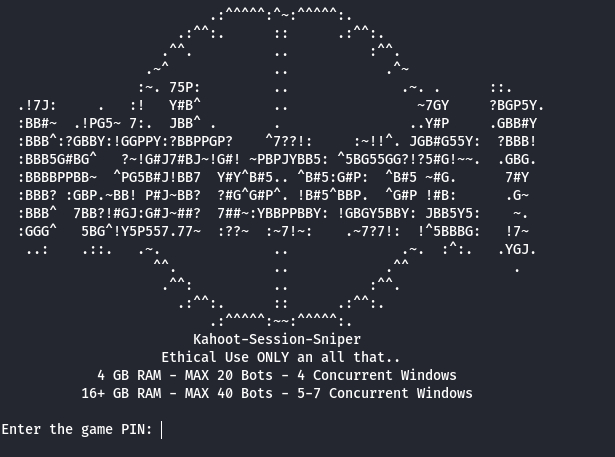
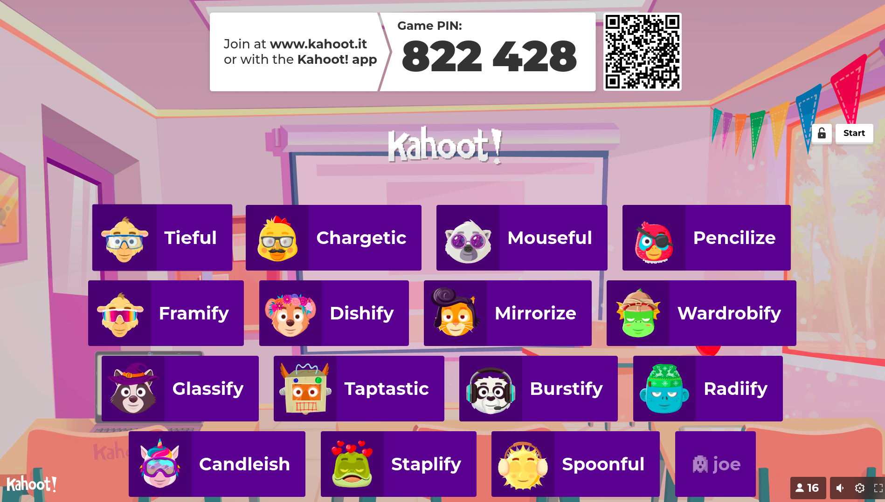

# KahootSessionSniper [](https://www.python.org/downloads/release)

## Images of Usage





## Description

KahootSessionSniper is a Python3 script designed to automate the process of joining a Kahoot game with multiple users simultaneously. It utilizes Selenium for web automation and threading for concurrent user joining.

## Features

- **Multi-User Joining:** Allows you to specify the number of users and their nicknames to join a Kahoot game concurrently.
- **Usernames:** Reads a list of usernames from a file for random selection during the joining process.
- **Semaphore:** Controls the maximum number of concurrent browser windows to avoid overwhelming the system.
- **Interactive Input:** Takes input for game PIN, number of users, and max concurrent windows.

## Prerequisites

- Python 3.x
- Selenium
- Webdriver (Chrome or other, depending on your browser choice)

## Recommended System Configurations

When running the script, choose the appropriate configuration based on your system's RAM:

| RAM   | Max Bots | Max Windows |
|-------|----------|-------------|
| 4GB   | 20       | 3 to 4      |
| 16GB+ | 40       | 5 to 7      |

## Usage

1. Clone the repository:

    ```bash
    git clone https://github.com/joemamasmom/KahootSessionSniper.git
    cd KahootSessionSniper
    ```

2. Install the required packages:

    ```bash
    pip install selenium
    ```

3. Download the appropriate webdriver for your browser and update the `webdriver.Chrome()` line in the script accordingly.

4. **Caution: Resource Usage**

    - **Do not run the script excessively in a short time window on the same server, as it may cause latency and consume a significant amount of resources.**
    - Be mindful of the impact on the server and network infrastructure.

5. Run the script:

    ```bash
    python3 main.py
    ```

6. Follow the on-screen instructions to enter the game PIN, number of users, and max concurrent windows.

## Note

- **Use responsibly and ensure compliance with Kahoot's terms of service.**
- **Depending on your RAM and CPU, adjust number of max concurrent windows to your needs. Using too many can slow your machine and possibly crash it as well.**
- After a bot has successfully joined the lobby, the window will be closed. 
- The script might need adjustments based on changes in the Kahoot website structure.

# License [](https://opensource.org/licenses/MIT)

This project is licensed under the [MIT License](LICENSE).

